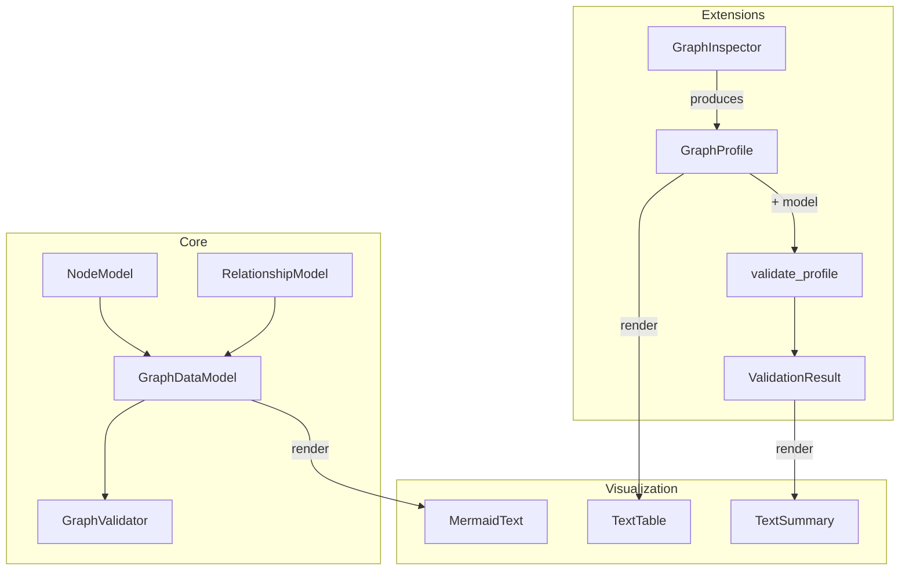

# Epic E3: Documentation & Onboarding

> **Priority:** High
> **Origin:** Code review 2026-05-07 (sections 2, 8: README, notebooks)
> **Goal:** Ensure a new developer or internal pilot user can understand, install, and use orthograph within 15 minutes
> **Estimated tasks:** 3

---

## Context

The README is the first artifact any evaluator encounters. Currently it
references Python 3.9, conda, internal Nexus URLs, and contains zero
information about what orthograph actually does. This is the single
highest-impact documentation gap. The notebooks are excellent but have
minor staleness (wrong titles, no shared model setup).

---

## Task E3.1: Rewrite README

**Objective:** Replace the current README.rst with a complete, accurate document that explains what orthograph is, how to install it, and shows a minimal working example.

**Context:** The current README (`README.rst`, 50 lines) is a legacy installation guide referencing Python 3.9, conda, internal GitLab/Nexus URLs, and certificate workarounds. It contains zero description of what orthograph does. The `pyproject.toml` correctly specifies Python >= 3.10 and lists optional dependencies. The README should be the authoritative entry point.

**Implementation:**

1. Rewrite `README.rst` (keeping RST format for Sphinx compatibility) with these sections:
   - **Header + one-line description**: "Pydantic-native graph data model definition and validation"
   - **What is Orthograph?**: 3-4 sentences positioning it (like Pandera for graphs)
   - **Key Features**: bullet list (Pydantic-native, cardinality, multi-backend, Cypher generation, etc.)
   - **Quick Start**: minimal code example (define model, validate data -- 15 lines)
   - **Installation**: `pip install orthograph` (core), `pip install orthograph[all]` (with extensions), `pip install -e .[dev]` (development)
   - **Optional Extensions**: table of extras (networkx, cypher, neo4j, memgraph, gqlalchemy)
   - **Documentation**: link to notebooks, link to .agentic/ for architecture
   - **Development**: clone, install editable, run tests, pre-commit hooks
   - **License**: Private (as per pyproject.toml classifier)

2. Remove all references to:
   - Python 3.9 (minimum is 3.10)
   - Conda (not required)
   - Internal Nexus repository URLs
   - Certificate workarounds
   - The old GitLab clone URL (keep as development section)

3. Ensure the quick start example actually runs (test it mentally against the current API).

**Acceptance criteria:**
- README answers "what is this?" in the first 3 lines
- Installation instructions match pyproject.toml
- Quick start example is valid Python that would pass validation
- No references to Python 3.9, conda, or Nexus
- Development section includes `pip install -e .[dev]` and `pytest`

---

## Task E3.2: Fix Notebook Titles and Metadata

**Objective:** Ensure all notebook titles match their numbering scheme and internal references are consistent.

**Context:** Notebook `01.04_visualization.ipynb` has the internal title "08 - Visualization" (from a previous numbering scheme). The renumbering to the current 01.xx/02.xx/03.xx system was done on filenames but some internal markdown titles were not updated.

**Implementation:**

1. Open each notebook and verify the first markdown cell title matches the filename numbering:
   - `01.01_defining_a_graph_data_model.ipynb` -> "01.01 -- Defining a Graph Data Model"
   - `01.02_validating_graph_data.ipynb` -> "01.02 -- Validating Graph Data"
   - `01.03_optionality_and_cardinality.ipynb` -> "01.03 -- Optionality and Cardinality"
   - `01.04_visualization.ipynb` -> "01.04 -- Visualization" (currently says "08 - Visualization")
   - `02.01_yaml_configuration.ipynb` -> "02.01 -- YAML Configuration"
   - `02.02_cypher_query_generation.ipynb` -> "02.02 -- Cypher Query Generation"
   - `03.01_networkx_inspection_and_validation.ipynb` -> "03.01 -- NetworkX Inspection and Validation"
   - `03.02_neo4j_end_to_end.ipynb` -> "03.02 -- Neo4j End-to-End (Reference)"
   - `03.03_gqlalchemy_integration.ipynb` -> "03.03 -- GQLAlchemy Compatibility"
   - `03.04_gqlalchemy_database_interaction.ipynb` -> "03.04 -- GQLAlchemy Database Interaction"

2. Fix any that don't match. At minimum, `01.04` needs its title changed from "08 - Visualization" to "01.04 -- Visualization".

3. Run the notebook test suite to ensure notebooks still execute: `pytest tests/notebooks/`

**Acceptance criteria:**
- All 10 notebook titles match their filename numbering
- Consistent format: `"XX.YY -- Title"`
- Notebook tests pass

---

## Task E3.3: Add Architecture Diagram to Documentation

**Objective:** Create a visual architecture overview (Mermaid diagram) that shows the package structure, dependency flow, and two-phase architecture at a glance.

**Context:** The `.agentic/index.md` describes the architecture in text and ASCII art. A proper Mermaid diagram would be more accessible for onboarding and could be included in both the README and Sphinx docs.

**Implementation:**

1. Add a Mermaid diagram to `.agentic/CONTEXT.md` (or a new `architecture.md` file) showing:
   - Package layers: core -> io, extensions, visualization
   - The two-phase flow: Inspector -> GraphProfile -> validate_profile -> ValidationResult
   - The GQLAlchemy interaction flow: model -> codegen -> client -> validate -> save

2. The diagram should be renderable via `display_mermaid()` in a notebook or via any Mermaid renderer.

3. Example structure:

4. Keep it simple and accurate -- this is for orientation, not exhaustive documentation.

**Acceptance criteria:**
- Diagram is valid Mermaid syntax
- Accurately represents the current architecture
- Placed in a location discoverable by new developers
